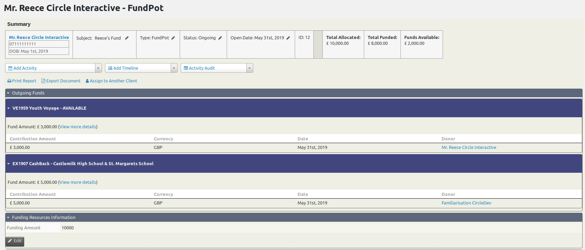
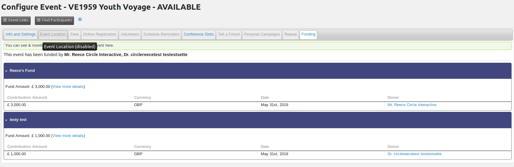
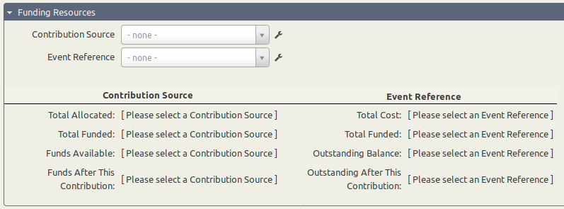
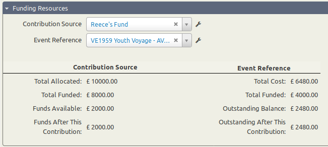
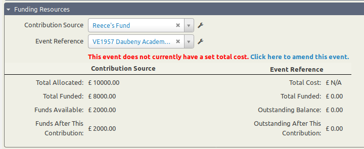
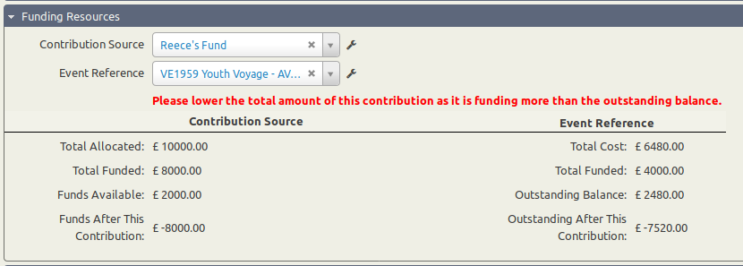
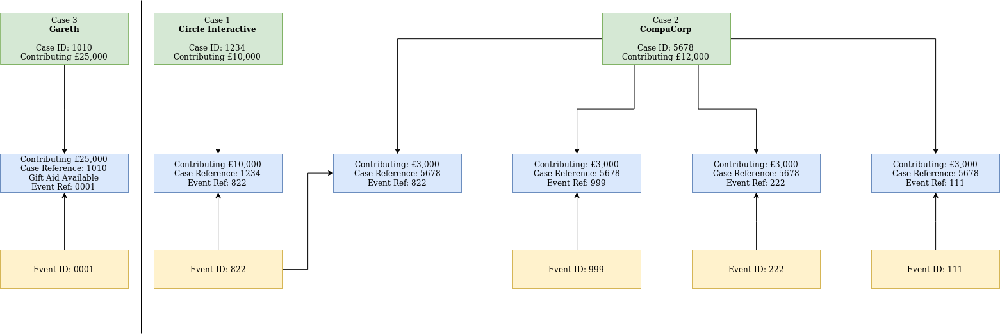

# FundingPot (uk.co.circleinteractive.fundpot)

Here is a small technical overview of this extension.

## API

This extension creates 4 new API calls:
* FpEvent
  * Used to get the specific event funded contributions by the Event ID
* FpSummary
  * Used to get the financial details of a Funding Pot by either the Case ID or Event ID
* FpFunds
  * Used to get the specific cases contributions by the Case ID
* FpFunders
  * Used to get the contributions sent to an event by the Event ID, separated by their Case

## Templates

This extension has multiple template modifiers, none of which override core template files to make CiviCRM upgrades efficient.
* CiviCase
  * When viewing a Case with the CaseType "FundPot", you will notice extra details at the top right that outline the Funding Summary of the Case. There is an additional inline table titled "Outgoing Funds" that displays all of the outgoing funds from the Case you're viewing and to what Events funds have been sent to.
  * 
* CiviEvent
  * When viewing an Event, there is an additional Tab called "Funding Overview" that shows you all of the funds that have been allocated to the Event you're viewing and what Funding Pot they have come from.
  * 
* CiviContribute
  * When creating a new Contribution, you will notice there is additional data under the "Funding Resources" Custom Group that will display funding details from the Case and Event that you specify.
    * Under "Contribution Source", you'll see the total amount allocated to that Case and how much is left in that Funding Pot, along with how much is left after you submit the Contribution you're making. If you go over the allocated amount, an error message will show up here.
    * Under "Event Reference", you'll see the amount currently funded to this Event and how much is left in order for the event to be fully funded.
  * 
  * 
  * 
  * 

## Workflow

The below workflow reflects OYT Scotland's workflow, and is what this extension was written around. The Case is a "FundPot", the Contribution is what links the Event and Case together, and the Event is what receives the funds. You're able to see the funds on all aspects (Case, Contribution and Event), each respectively showing values depending on what you're looking at (and your current inputs, if any).

## Entities

Multiple entities are handled by this extension, so when disabling / enabling / installing / uninstalling this extension, these entities will be automatically enabled / disabled / created / deleted.

#### Custom Groups

Entity: "fundpot_funding_resources"
  - Name: "FP_Funding_Resources"
  - Title: "Funding Resources"

Entity: "fundpot_funding_resources_info"
  - Name: "FP_Funding_Resources_Information"
  - Title: "Funding Resources Information"

Entity: "civicrm_fundpot_event_cost"
  - Name: "FP_Event_Cost"
  - Title: "Event Cost"

#### Custom Fields

Entity: "fundpot_event_reference"
  - Name: "fundpot_cf_event_reference"
  - Label: "Event Reference"
  - Uses: "fundpot_eventcontrib"

Entity: "fundpot_contrib_source"
  - Name: "fundpot_cf_contrib_source"
  - Label: "Contribution Source"
  - Uses: "fundpot_eventcontrib"

Entity: "fundpot_fund_amount"
  - Name: "fundpot_cf_fund_amount"
  - Label: "Funding Amount"

Entity: "fundpot_event_cost"
  - Name: "fundpot_cf_event_cost"
  - Label: "Funding Amount"

#### Financial Types

Entity: "fundpot_ft_fundraiser"
  - Name: "FundPot Fundraiser"

#### Option Groups

Entity: "fundpot_empty_optiongroup"
  - Name: "fundpot_eventcontrib"
  - Title: "Event / Contribution Source"
  - Used by (Custom Fields):
    - fundpot_cf_event_reference
    - fundpot_cf_contrib_source